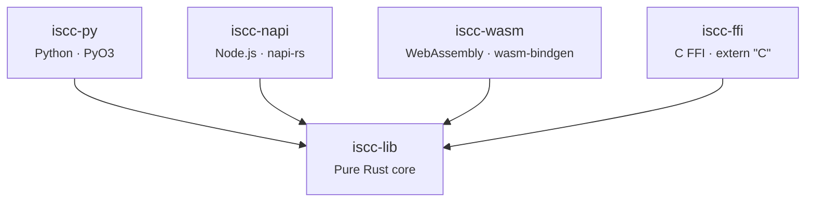

# Architecture

An overview of how iscc-lib is structured — the crate model, module layout, streaming pattern, and
conformance testing approach.

---

## Hub-and-Spoke Crate Model

iscc-lib uses a **hub-and-spoke** architecture. A single pure-Rust core crate (`iscc-lib`) contains
all ISCC algorithms. Each binding crate depends on the core and translates its API to the target
language. The core has no FFI concerns — it publishes to crates.io independently.



All binding crates are thin wrappers — they contain no algorithm logic. This ensures that every
language produces identical results for the same inputs.

## Workspace Layout

The repository follows kreuzberg's `crates/` directory pattern with centralized dependency
management via `workspace.dependencies` in the root `Cargo.toml`.

```
iscc-lib/
├── Cargo.toml                  # Virtual workspace root
├── pyproject.toml              # Python project (uv)
├── zensical.toml               # Documentation config
├── mise.toml                   # Tool versions + tasks
├── .pre-commit-config.yaml     # prek hooks
├── docs/                       # Documentation site
├── notes/                      # Architecture notes
├── benchmarks/                 # Rust + Python benchmarks
│   ├── rust/
│   └── python/
├── crates/
│   ├── iscc-lib/               # Core Rust library
│   │   ├── Cargo.toml
│   │   ├── src/                # Algorithm implementations
│   │   └── tests/              # Conformance test vectors
│   ├── iscc-py/                # Python bindings
│   │   ├── Cargo.toml
│   │   ├── pyproject.toml      # maturin build config
│   │   ├── src/lib.rs          # PyO3 wrappers
│   │   └── python/iscc_lib/    # Python package + type stubs
│   ├── iscc-napi/              # Node.js bindings
│   │   ├── Cargo.toml
│   │   ├── package.json        # npm package config
│   │   ├── src/lib.rs          # napi-rs wrappers
│   │   └── __tests__/          # Node.js conformance tests
│   ├── iscc-wasm/              # WebAssembly bindings
│   │   ├── Cargo.toml
│   │   ├── package.json        # npm package config
│   │   ├── src/lib.rs          # wasm-bindgen exports
│   │   └── tests/              # WASM integration tests
│   └── iscc-ffi/               # C FFI bindings
│       ├── Cargo.toml
│       ├── src/lib.rs          # extern "C" functions
│       └── tests/              # C test program
└── .github/workflows/
    ├── ci.yml                  # Test + lint
    └── pages.yml               # Documentation deployment
```

### Crate Summary

| Crate       | Produces                         | Build Tool     | Published To |
| ----------- | -------------------------------- | -------------- | ------------ |
| `iscc-lib`  | Rust library                     | cargo          | crates.io    |
| `iscc-py`   | Python wheel                     | maturin + PyO3 | PyPI         |
| `iscc-napi` | Native Node.js addon             | napi-rs        | npm          |
| `iscc-wasm` | WASM package                     | wasm-bindgen   | npm          |
| `iscc-ffi`  | Shared library (.so/.dll/.dylib) | cargo          | Source       |

## Internal Module Structure

The `iscc-lib` core crate uses a **tiered API** to control what gets exposed to bindings and
downstream Rust consumers.

### Tier 1 — Stable Public API

The 9 `gen_*_v0` functions are the stable entrypoints, bound in all languages. They are `pub`
functions in the crate root (`lib.rs`). Changes require a SemVer MAJOR bump.

```rust
// All gen_*_v0 functions are pub in the crate root
pub fn gen_meta_code_v0(name, description, meta, bits) -> IsccResult<String>
pub fn gen_text_code_v0(text, bits) -> IsccResult<String>
pub fn gen_image_code_v0(pixels, bits) -> IsccResult<String>
pub fn gen_audio_code_v0(cv, bits) -> IsccResult<String>
pub fn gen_video_code_v0(frame_sigs, bits) -> IsccResult<String>
pub fn gen_mixed_code_v0(codes, bits) -> IsccResult<String>
pub fn gen_data_code_v0(data, bits) -> IsccResult<String>
pub fn gen_instance_code_v0(data, bits) -> IsccResult<String>
pub fn gen_iscc_code_v0(codes, wide) -> IsccResult<String>
```

### Tier 2 — Public Rust API

The `codec` module is public for Rust consumers but not exposed through FFI bindings. It provides
base32 encoding/decoding and header manipulation utilities. May change in MINOR releases.

### Internal Modules

These modules implement the core algorithms and are `pub(crate)` — never exposed to bindings or
external Rust consumers. Free to change at any time.

| Module    | Purpose                                        |
| --------- | ---------------------------------------------- |
| `cdc`     | Content-Defined Chunking for Data-Code         |
| `dct`     | Discrete Cosine Transform for Image-Code       |
| `minhash` | MinHash algorithm for Text-Code and Data-Code  |
| `simhash` | SimHash algorithm for Meta-Code and Audio-Code |
| `utils`   | Text normalization, hashing helpers            |
| `wtahash` | Winner-Take-All Hash for Video-Code            |

## Streaming Pattern

ISCC operations are **CPU-bound, not I/O-bound** — hashing and chunking are pure computation on byte
slices. The core library takes bytes, not file paths. File I/O is the caller's responsibility.

This drives a key design decision: **the Rust core is synchronous**. Each binding adapts to its
runtime's async model outside the core.

### Core Pattern

Data-Code and Instance-Code support streaming via a three-phase pattern:

```
new() → update(&[u8]) → finalize() → Result<T>
```

This matches the approach used by `std::io::Write` and `blake3::Hasher`. Callers feed data in chunks
of any size, then finalize to get the result.

### Per-Binding Adaptation

| Binding     | Async Strategy                                                                            |
| ----------- | ----------------------------------------------------------------------------------------- |
| **Python**  | Sync API, GIL released during `update()`. Callers use `asyncio.to_thread()` if needed     |
| **Node.js** | napi-rs `AsyncTask` offloads to libuv thread pool, returning `Promise<T>`                 |
| **WASM**    | Sync exports — no threading in browser WASM                                               |
| **C FFI**   | `ctx_new()` / `ctx_update()` / `ctx_finalize()` / `ctx_free()` — standard streaming C API |

!!! note "Why not async in the core?"

    Adding `async fn` to the core would force all consumers to bring a runtime (tokio), including WASM
    and C FFI where that makes no sense. There are no awaitable operations — hashing and chunking are
    pure computation. The rule: never expose Rust async across FFI boundaries.

## Conformance Testing

All bindings share the same conformance test vectors — a vendored snapshot of `data.json` from the
official [iscc-core](https://github.com/iscc/iscc-core) Python reference implementation.

### How It Works

1. The canonical `data.json` file lives in `crates/iscc-lib/tests/data.json`
2. Every binding loads the **same file** (via relative path or `include_str!`)
3. Test vectors contain inputs and expected outputs for all 9 `gen_*_v0` functions
4. Tests are parametrized — each test case name maps to a key in the JSON

### Cross-Language Test Matrix

| Language | Test Runner   | Vector Access                   |
| -------- | ------------- | ------------------------------- |
| Rust     | `cargo test`  | `include_str!` at compile time  |
| Python   | pytest        | Relative path from test file    |
| Node.js  | `node:test`   | Relative path from `__tests__/` |
| WASM     | `cargo test`  | `include_str!` (no filesystem)  |
| C        | gcc + runtime | Linked against shared library   |

This approach catches cross-language drift — encoding differences, rounding behavior, default
parameter mismatches — immediately when any binding diverges from the reference.
